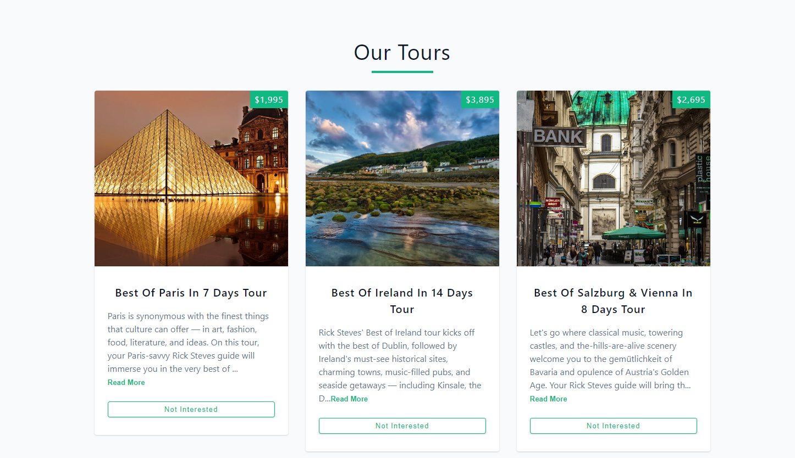

# Tours React Project

[Go to live demo](https://tours-rivki.netlify.app/)

This is a simple React project built with Vite. I created this project as part of React course on Udemy by John Smilga. It serves as a practice exercise for utilizing the useEffect hook in React.

## Project Description

The "Tours" React project is a simple web application that displays a list of tours. Each tour is represented by a card containing an image, a short description, and its price. Users have the option to mark tours as "not interested" to remove them from the list.

## Technologies Used

- React
- Vite (for project setup)
- HTML/CSS
- JavaScript
